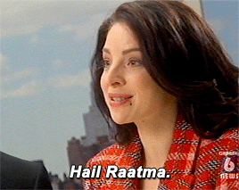

- 👋 Hi, I’m @zeionara
- 👀 I’m interested in emerging areas of machine learning and new technologies to support them
- 🌱 I’m currently learning the ways to improve quality of knowledge embedding models for processing linked data
- 💞️ I’m looking to collaborate on various projects concerning machine learning models engineering as well as creation of inventive tools for software development in general
- 📫 You can reach me through [telegram](https://t.me/zeionara) or [email](mailto:zeionara@gmail.com)
- And off course...

    

<!---
zeionara/zeionara is a ✨ special ✨ repository because its `README.md` (this file) appears on your GitHub profile.
You can click the Preview link to take a look at your changes.
--->
